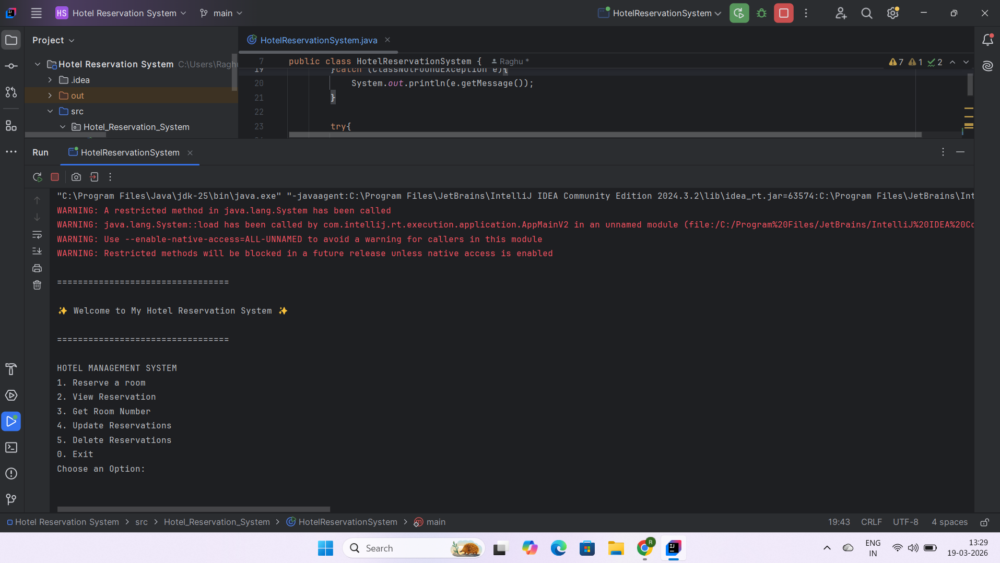
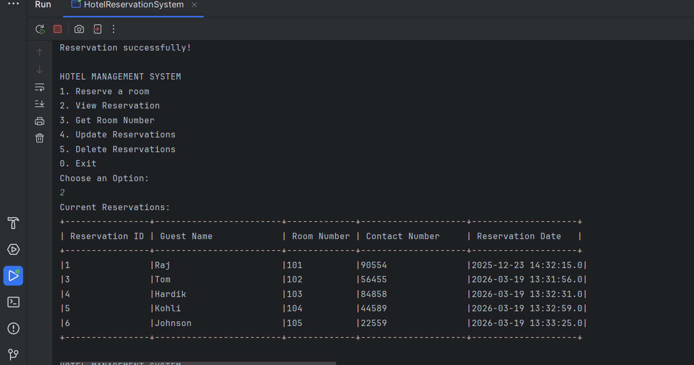

# 🏨 Hotel Reservation System

A console-based application developed using Java and MySQL to manage hotel room reservations. This system allows users to perform CRUD operations like reserving rooms, viewing bookings, updating, and deleting reservations.

---

## 🚀 Features

* Reserve a room
* View all reservations
* Get room number by reservation ID
* Update reservation details
* Delete reservation
* Console-based user interaction

---

## 🛠️ Tech Stack

* **Language:** Java
* **Database:** MySQL
* **Concepts Used:** OOP, JDBC, Exception Handling, Basic Multithreading

---

## 💡 Project Overview

This project demonstrates the use of Java JDBC to connect with a MySQL database and perform real-world operations like managing hotel bookings. It uses SQL queries to insert, update, retrieve, and delete reservation records.

---

## 📸 Screenshots

### Menu Screen



### Reservation List



---

## ▶️ Run Locally

1. Clone the repository
   git clone https://github.com/RaghuChauhan1999/hotel-reservation-system-java

2. Open in IDE (IntelliJ / VS Code)

3. Create MySQL database:

```
CREATE DATABASE hotel_db;
```

4. Create table:

```
CREATE TABLE reservations (
    reservation_id INT AUTO_INCREMENT PRIMARY KEY,
    guest_name VARCHAR(100),
    room_number INT,
    contact_number VARCHAR(15),
    reservation_date TIMESTAMP DEFAULT CURRENT_TIMESTAMP
);
```

5. Update database credentials in code:

```
private static final String url = "jdbc:mysql://localhost:3306/hotel_db";
private static final String username = "root";
private static final String password = "your_password";
```

6. Run the application

---

## 📌 Sample Menu

```
HOTEL MANAGEMENT SYSTEM
1. Reserve a room
2. View Reservation
3. Get Room Number
4. Update Reservations
5. Delete Reservations
0. Exit
```

---

## 🔥 Key Learnings

* Used JDBC for database connectivity
* Performed CRUD operations using SQL queries
* Handled exceptions in Java
* Implemented menu-driven console application
* Used basic multithreading for UI effects

---

## 👨‍💻 Author

Raghu Chauhan
